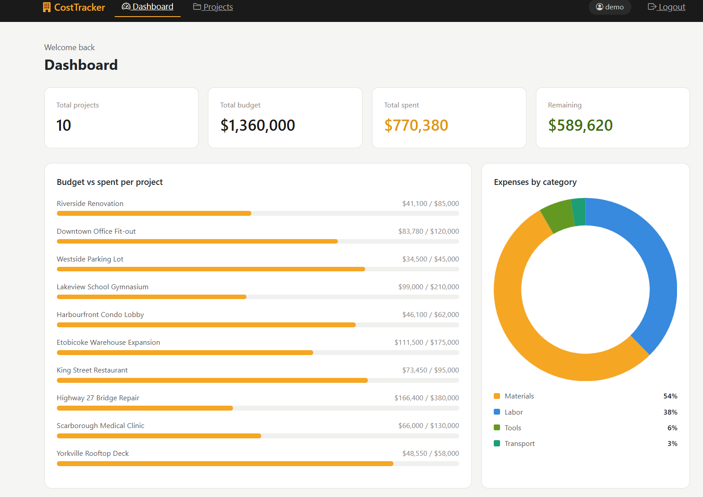
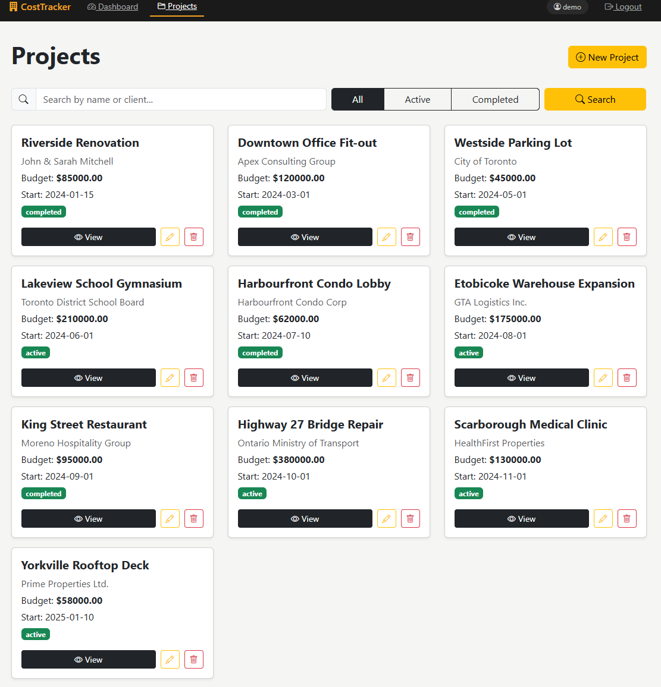
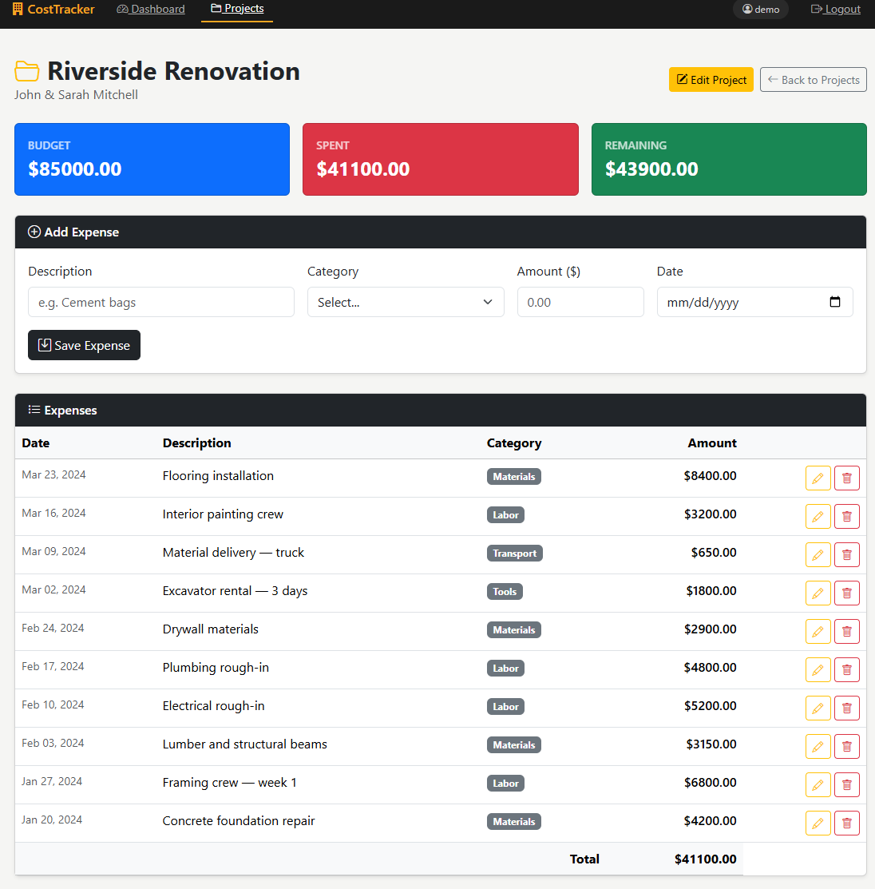
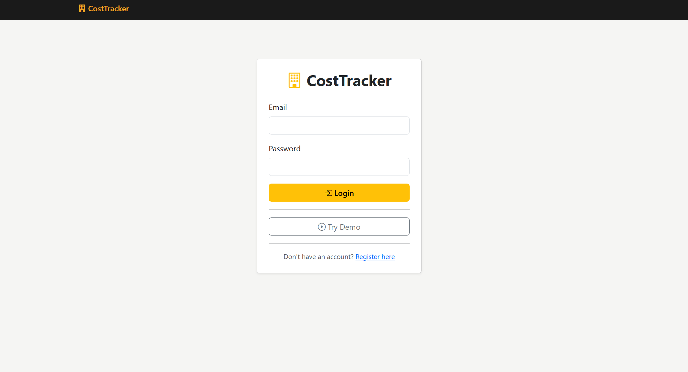

# 🏗️ CostTracker — Construction Cost Management


# 🏗️ CostTracker — Construction Cost Management


> **The problem:** Small contractors track budgets in scattered spreadsheets leading to cost overruns discovered too late and no real-time visibility across projects.
>
> **What this solves:** A centralized dashboard where contractors instantly see which projects are over budget, before it becomes a crisis.

Replacing error-prone spreadsheets with a centralized cost management tool built for contractors and project managers. Track budgets, log expenses and visualize performance across all your construction projects in one secure dashboard.

Replacing error-prone spreadsheets with a centralized cost management tool built for contractors and project managers. Track budgets, log expenses and visualize performance across all your construction projects in one secure dashboard.



## 🚀 Live Demo

🌐 **[https://web-production-d477f.up.railway.app](https://web-production-d477f.up.railway.app)**

> **Demo credentials**
> - Email: `demo@costtracker.com`
> - Password: `demo1234`

## 📸 Screenshots

### 📊 Projects


### 📁 Project Detail


### 🔐 Login


## ✨ Features

- **Dashboard** — Real-time overview with stat cards, budget vs spent progress bars, expenses by category donut chart, and recent projects table
- **Project Management** — Full CRUD for projects with budget tracking and status management
- **Expense Tracking** — Log expenses by category (Materials, Labor, Tools, Transport, Other)
- **Search & Filter** — Search projects by name or client, filter by status (Active / Completed)
- **CSV Export** — Download expenses per project or all projects at once
- **Authentication** — Secure login and registration with Flask-Login
- **Row-level Security** — Users only see their own data
- **Demo Mode** — One-click demo account with 10 realistic Toronto construction projects

## 🔒 Security

- CSRF protection on all forms via Flask-WTF
- Password hashing with Werkzeug
- Rate limiting on login (10/min) and demo login (5/min) via Flask-Limiter
- Secret key and database URL loaded from environment variables
- Debug mode disabled in production
- `.env`, `*.db`, and `venv/` excluded from version control

## 🛠️ Tech Stack

- **Python 3 + Flask 3.0.3** — backend framework
- **Flask-SQLAlchemy + PostgreSQL** — database layer
- **Flask-Login** — session authentication
- **Flask-WTF** — CSRF protection
- **Flask-Limiter** — rate limiting
- **Bootstrap 5 + Chart.js** — frontend UI and charts
- **python-dotenv** — environment variable management
- **Railway** — cloud deployment

## ⚙️ Setup Instructions

### 1. Clone the repository
```bash
git clone https://github.com/moisesvivass/construction-cost-tracker.git
cd construction-cost-tracker
```

### 2. Create and activate virtual environment
```bash
# Windows
python -m venv venv
venv\Scripts\activate

# Mac/Linux
python -m venv venv
source venv/bin/activate
```

### 3. Install dependencies
```bash
pip install -r requirements.txt
```

### 4. Create your `.env` file
```
SECRET_KEY=your-secret-key-here
DATABASE_URL=sqlite:///tracker.db
FLASK_DEBUG=1
```

Generate a secure secret key:
```bash
python -c "import secrets; print(secrets.token_hex(32))"
```

### 5. Seed demo data (optional)
```bash
python seed_demo.py
```

### 6. Run the app
```bash
python run.py
```

Visit `http://127.0.0.1:5000`

## 🗄️ Database Schema
```
User
├── id (PK)
├── username
├── email
└── password (hashed)
    │
    └── has many Projects
            ├── id (PK)
            ├── name
            ├── client
            ├── budget
            ├── start_date
            ├── status
            └── user_id (FK → User)
                │
                └── has many Expenses
                        ├── id (PK)
                        ├── description
                        ├── category
                        ├── amount
                        ├── date
                        └── project_id (FK → Project)
```

**Relationships:** User → Project (1:N) — Project → Expense (1:N) — Cascade delete enabled

## 📁 Project Structure
```
construction-cost-tracker/
├── app/
│   ├── __init__.py            # App factory, extensions
│   ├── models.py              # User, Project, Expense models
│   ├── routes.py              # All routes and business logic
│   ├── static/
│   └── templates/
│       ├── base.html          # Base layout + navbar
│       ├── dashboard.html     # Main dashboard with charts
│       ├── projects.html      # Projects list + search & filter
│       ├── project_detail.html
│       ├── new_project.html
│       ├── edit_project.html
│       ├── edit_expense.html
│       ├── login.html
│       ├── register.html
│       ├── 404.html
│       └── 500.html
├── docs/
│   └── screenshots/
├── instance/                  # SQLite database (gitignored)
├── venv/                      # Virtual environment (gitignored)
├── .env                       # Environment variables (gitignored)
├── config.py                  # Configuration class
├── run.py                     # App entry point
├── seed_demo.py               # Demo data seeder
├── Procfile                   # Railway/Render process file
├── render.yaml                # Render deployment config
└── requirements.txt
```

## ✅ Roadmap

- [x] Full CRUD — Projects and Expenses
- [x] Authentication + row-level security
- [x] Validation + form repopulation on errors
- [x] Custom 404/500 error pages
- [x] Cascade delete
- [x] Dashboard with Chart.js
- [x] Search & Filter projects
- [x] CSRF protection on all forms
- [x] Rate limiting on login routes
- [x] CSV Export
- [x] Demo mode with 10 realistic projects
- [x] Deploy to Railway with PostgreSQL

## 👨‍💻 Author

**Moises Vivas** — CS graduate building backend systems in Python · Toronto, Canada

- GitHub: [github.com/moisesvivass](https://github.com/moisesvivass)